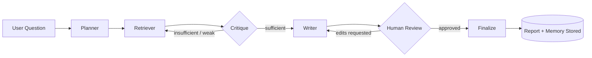

<div align="center">

# Derve

### An agentic, source-grounded research assistant

*Ask a question. Watch it plan, search, critique itself, and hand you back a cited report — with you in the loop the whole way.*


</div>

---

## Table of Contents

1. [Project Overview](#overview)
2. [Core Features](#features)
3. [Technology Stack](#stack)
4. [Repository Structure](#structure)
5. [Runtime Architecture](#architecture)
6. [Authentication & User Model](#auth)
7. [Document Ingestion & RAG Flow](#rag)
8. [Memory Model](#memory)
9. [Database Model](#database)
10. [Environment Variables](#env)
11. [Setup and Installation](#setup)
12. [Running Tests](#tests)
13. [Notes on Current Project Status](#status)
14. [Typical User Flow](#userflow)
15. [Future Enhancements](#future)
16. [Summary](#summary)

---

<a name="overview"></a>
## 1. Project overview

Derve aims to solve the problem of fragmented research workflows:
- users open many tabs,
- research is slow and repetitive,
- answers often lack grounded citations,
- memory is lost between sessions,
- and there is no built-in way to review the agent's work before treating it as final.

The application is designed to give a user a "research co-pilot" that:
1. interprets the user's question,
2. plans sub-questions,
3. retrieves information from relevant sources,
4. checks whether the information is sufficient,
5. drafts a report,
6. asks for approval or edits,
7. stores the final answer and long-term memory for future sessions.

> The result is a structured, source-backed research workflow with a strong emphasis on traceability and human control.

---

<a name="features"></a>
## 2. Core features

#### Agentic research pipeline
- Multi-step LangGraph execution
- Planner → Retriever → Critique → Writer → Finalize flow
- Bounded retry loops for insufficient retrieval or weak reports
- Human-in-the-loop review before finalization

#### RAG knowledge base
- User-uploaded documents can be stored and indexed
- Supported upload types: PDF, TXT, MD
- Text is chunked and embedded
- Chunks are stored in Qdrant with user-scoped filtering
- Retrieval is scoped to the authenticated user

#### Web grounding
- Web search is used to supplement private knowledge
- Search providers can be toggled in settings
- Relevant results are combined with RAG results before writing the final report

#### Threaded research sessions
- Every research request is stored as a thread
- Sessions can be resumed and continued later
- Research checkpoints are persisted in Postgres

#### Long-term memory
- The app stores durable user interests and preferences
- Memory is namespaced by user ID
- Users can view and delete memory entries from the Memory page

#### User settings
- LLM provider selection
- Web search toggle
- Per-user settings storage in Postgres

#### Authentication
- Email/password signup and login
- Session-based auth via bearer tokens using a local auth mechanism
- User data kept separate and private per account

#### Reports and exports
- Reports are stored in Postgres
- Final reports can be reviewed and edited
- Export support is intended for Markdown/PDF output

---

<a name="stack"></a>
## 3. Technology stack

### Frontend

| Layer | Technology |
|:---|:---|
| Framework | Next.js 16 |
| UI | React 19 |
| Styling | Tailwind CSS |
| Markdown rendering | react-markdown + remark-gfm |
| App routing | Next.js App Router |

### Backend

| Layer | Technology |
|:---|:---|
| API | FastAPI |
| Lang orchestration | LangGraph |
| LLM integration | LangChain + Groq + Gemini |
| Search | Tavily + DuckDuckGo |
| Embeddings | fastembed + Hugging Face models |
| Vector DB | Qdrant |
| Relational DB | Postgres via psycopg |
| Auth | custom bearer-token auth system |
| Runtime | Uvicorn |

### Data and infrastructure

| Layer | Technology |
|:---|:---|
| Primary database | Neon / Postgres |
| Vector store | Qdrant Cloud or self-hosted Qdrant |
| Session / checkpointer storage | Postgres-backed LangGraph checkpointing |
| Observability | LangSmith |

### Tooling

| Tool | Purpose |
|:---|:---|
| Python virtual environment | backend dependency isolation |
| npm | frontend dependency installation |
| pytest | backend test execution |
| TypeScript | frontend type safety |
| ESLint | linting |

---

<a name="structure"></a>
## 4. Repository structure

```text
Derve/
├── backend/
│   ├── app/
│   │   ├── agent/
│   │   │   ├── graph.py
│   │   │   ├── state.py
│   │   │   └── nodes/
│   │   │       ├── critique.py
│   │   │       ├── finalize.py
│   │   │       ├── hitl.py
│   │   │       ├── planner.py
│   │   │       ├── retriever.py
│   │   │       └── writer.py
│   │   ├── api/
│   │   │   ├── documents.py
│   │   │   ├── memory.py
│   │   │   ├── reports.py
│   │   │   ├── settings.py
│   │   │   ├── stream.py
│   │   │   └── threads.py
│   │   ├── auth/
│   │   │   ├── deps.py
│   │   │   ├── routes.py
│   │   │   ├── security.py
│   │   │   └── __init__.py
│   │   ├── db/
│   │   │   ├── checkpointer.py
│   │   │   ├── db.py
│   │   │   ├── memory.py
│   │   │   ├── store.py
│   │   │   └── __init__.py
│   │   ├── rag/
│   │   │   ├── answer.py
│   │   │   ├── ingest.py
│   │   │   ├── retrieve.py
│   │   │   └── __init__.py
│   │   ├── vectorstore/
│   │   │   ├── qdrant_client.py
│   │   │   └── __init__.py
│   │   ├── config.py
│   │   ├── main.py
│   │   └── __init__.py
│   ├── requirements.txt
│   ├── test_agent.py
│   ├── test_api.py
│   ├── test_auth.py
│   ├── test_checkpoint.py
│   ├── test_hitl.py
│   ├── test_memory.py
│   ├── test_rag.py
│   └── .env
├── frontend/
│   ├── src/
│   │   ├── app/
│   │   │   ├── dashboard/
│   │   │   ├── history/
│   │   │   ├── login/
│   │   │   ├── memory/
│   │   │   ├── research/
│   │   │   ├── settings/
│   │   │   ├── signup/
│   │   │   ├── globals.css
│   │   │   ├── layout.tsx
│   │   │   └── page.tsx
│   │   ├── components/
│   │   │   ├── AppLayout.tsx
│   │   │   └── MarkdownRenderer.tsx
│   │   ├── lib/
│   │   │   └── api.ts
│   │   └── proxy.ts
│   ├── package.json
│   ├── next.config.ts
│   ├── tsconfig.json
│   ├── eslint.config.mjs
│   ├── postcss.config.mjs
│   └── public/
├── docs/
│   ├── ARCH.md
│   ├── DESIGN.html
│   ├── DEV_PLAN.md
│   ├── PRD.md
│   ├── SRS.md
│   └── UI-UX.md
├── .gitignore
├── README.md
└── .env.example (if present in your repo; otherwise create it)
```

---

<a name="architecture"></a>
## 5. Runtime architecture

### Backend runtime
The backend server is built around FastAPI and exposes endpoints for:
- auth signup/login/logout
- thread creation and listing
- streaming agent progress
- documents upload/list/delete
- settings get/update
- reports retrieval/export
- memory listing/deletion

The app initializes Postgres tables, Qdrant collection setup, and LangGraph state store during startup.

### Frontend runtime
The frontend is a Next.js app with routes for:
- login
- signup
- dashboard
- new research
- history
- memory
- settings

It communicates with the backend through the API layer in `frontend/src/lib/api.ts` and stores the auth token locally in browser storage.

### Agent runtime
The core research workflow is implemented in the agent graph:
- planner prepares a decomposition of the user's question,
- retriever queries the user's personal document knowledge base and live web data,
- critique reviews the sufficiency or quality of retrieval,
- writer composes the response,
- finalize stores memory and final output.



---

<a name="auth"></a>
## 6. Authentication and user model

The project is intentionally simple and personal:
- one user account per email,
- session-based access,
- user-scoped data isolation,
- no social auth,
- no team workspaces,
- no complex RBAC in the initial version.

The backend uses custom JWT-like bearer token auth with `Authorization: Bearer <token>` headers. All user-specific resources (threads, documents, reports, memory, retrieval results) are filtered by the authenticated user ID.

---

<a name="rag"></a>
## 7. Document ingestion and RAG flow

The document pipeline works like this:

| Step | Action |
|:---:|:---|
| 1 | User uploads a PDF/TXT/MD file from the Settings page. |
| 2 | Backend validates extension and size. |
| 3 | File content is read as text. |
| 4 | PDF files are parsed with `pypdf` before indexing. |
| 5 | Text is chunked with a recursive splitter. |
| 6 | Chunks are embedded and stored in Qdrant. |
| 7 | A document record is added to Postgres metadata table. |
| 8 | Retrieval later uses the same user-scoped filtering to surface only the user's own knowledge. |

This gives each user a private knowledge base that can be searched during future research tasks.

---

<a name="memory"></a>
## 8. Memory model

Memory entries are stored in the LangGraph Postgres store using namespaced keys by user.

Schema conceptually looks like:
- namespace: `("memory", user_id)`
- key: UUID-based memory id
- value:
  - summary
  - category
  - created_at

This is used to remember durable user interests and preferences across sessions, which is displayed on the Memory page.

---

<a name="database"></a>
## 9. Database model

The backend initializes tables for:
- `users`
- `sessions`
- `documents`
- `reports`
- `user_settings`

Additionally, LangGraph manages checkpoint and memory state in Postgres through its own store/checkpointer integrations.

This architecture allows the app to preserve threads and user state even when the server restarts.

---

<a name="env"></a>
## 10. Environment variables

Create a backend `.env` file based on the project's actual runtime expectations.

Example:

```env
DATABASE_URL=postgresql://... 
QDRANT_URL=https://... 
QDRANT_API_KEY=... 
GROQ_API_KEY=... 
GEMINI_API_KEY=... 
TAVILY_API_KEY=... 
LANGSMITH_API_KEY=... 
LANGSMITH_PROJECT=Derve 
AUTH_SECRET=... 
```

Frontend runtime can use:

```env
NEXT_PUBLIC_BACKEND_URL=http://localhost:8000
```

The backend config file reads values from `.env` via `pydantic-settings` in `backend/app/config.py`.

---

<a name="setup"></a>
## 11. Setup and installation

### Prerequisites
- Python 3.10+
- Node.js 18+
- npm
- Postgres-compatible database access (Neon or local Postgres)
- Qdrant instance or Qdrant Cloud access

### 1) Backend setup
```bash
cd backend
python -m venv venv
source venv/bin/activate   # Windows: venv\Scripts\activate
pip install -r requirements.txt
```

### 2) Frontend setup
```bash
cd frontend
npm install
```

### 3) Configure environment
- Create a `.env` in `backend/` with your keys and DB URLs.
- For frontend, ensure `NEXT_PUBLIC_BACKEND_URL` is set if needed.

### 4) Run backend
```bash
cd backend
uvicorn app.main:app --reload --host 0.0.0.0 --port 8000
```

### 5) Run frontend
```bash
cd frontend
npm run dev
```

Then open:
- frontend: http://localhost:3000
- backend API: http://localhost:8000

---

<a name="tests"></a>
## 12. Running tests

The project includes API and feature-level smoke tests under `backend/`.

Example:

```bash
cd backend
python test_api.py
```

You can also run other tests such as:
- `test_auth.py`
- `test_memory.py`
- `test_rag.py`
- `test_agent.py`

These tests exercise key flows including authentication, document upload, memory persistence, and research pipeline behavior.

---

<a name="status"></a>
## 13. Notes on current project status

This project is an active research/portfolio application with working building blocks for:
- authentication,
- document ingestion,
- vector-backed retrieval,
- memory persistence,
- LLM-based report generation,
- live UI flow.

> It is not a polished production SaaS yet; it is closer to a strong internal prototype / MVP with strong architecture and clear extension points.

The project also includes design and product documents in the `docs/` folder, which provide product requirements, architecture, UI, and planning context.

---

<a name="userflow"></a>
## 14. Typical user flow

1. Create account with email/password.
2. Log in.
3. Start a new research session.
4. Ask a question or research topic.
5. Watch the system decompose and search.
6. Review sources and generated reasoning.
7. Approve, edit, or reject the draft.
8. Final report is saved.
9. Memory and settings are persisted for future loops.
10. Upload private documents to enrich future research with your personal knowledge base.

---

<a name="future"></a>
## 15. Future enhancements

Potential next steps for the project include:
- [ ] better export formatting (Markdown/PDF export polish)
- [ ] improved UX for the review/edit flow
- [ ] richer memory summarization and retrieval
- [ ] more robust error-handling and retries
- [ ] better deployment automation
- [ ] Dockerization for one-command startup
- [ ] CI/CD and production security hardening

---

<a name="summary"></a>
## 16. Summary

Derve is a local-first, user-scoped, agentic research assistant built for grounded research. It combines a modern Next.js frontend with a Python FastAPI backend, LangGraph orchestration, Postgres persistence, Qdrant-based RAG, and external LLM/search services to create an end-to-end research workflow that feels closer to an autonomous research teammate than a simple chatbot.

This project is ideal for:
- research automation demos,
- knowledge assistant prototypes,
- AI-driven report generation workflows,
- LLM + RAG local-first experimentation,
- portfolio-grade AI product development.

<div align="center">

---

Built with FastAPI, LangGraph, Next.js, Postgres, and Qdrant.

</div>